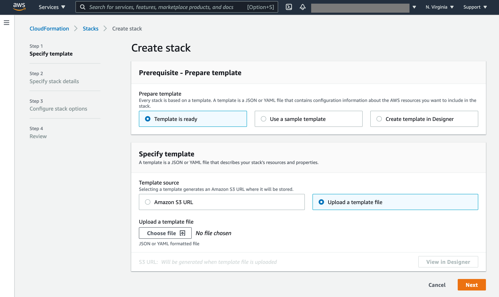

# Content Moderation with AWS AI Services

The daily volume of User Generated Content (UGC) and third-party content has been increasing substantially in industries such as social media, social gaming, online forums, dating & matrimonial, and photo sharing websites, and companies are struggling to deal with the sudden increase in volume, complexity, and cost associated to content moderation.

To help you overcome these challenges, AWS Machine Learning (ML) now provides you choices when it comes to moderating the content of different media types, including image, video, audio, and text.


## Content Moderation overview

<p align="center">
  
</p>

In this workshop, we will deep-dive into each of these media types with solutions to automate moderation.
We have hands-on labs to familiarize yourself with AWS AI services ( Amazon Rekognition, Amazon Transcribe, Amazon Comprehend, Amazon Translate and Amazon A2I) to build your solution.

### Moderate images and videos using [Amazon Rekognition](https://aws.amazon.com/rekognition/)

**Amazon Rekognition** is a managed Computer Vision AI service that makes it easy to add image and video analysis to your applications. This workshop contains multiple hands-on labs that guide you through how to use Rekognition to moderate [Images](01-image-moderation/) and [Videos](02-video-moderation/). You can also find extensive examples under the folders, such as how to moderate text in images and videos and set up a human-in-the-loop review process by orchestrating Amazon Rekognition and Amazon A2I.

### Moderate audios using [Amazon Transcribe](https://aws.amazon.com/transcribe/)

**Amazon Transcribe** is an automatic speech recognition (ASR) service that makes it easy for developers to add speech-to-text capability to their applications. Amazon Transcribe allows you to create [Custom Vocabulary Filters](https://docs.aws.amazon.com/transcribe/latest/dg/vocabulary-filtering.html) to delete, mask, or flag words while transcribing the voice to speach. You can find end-to-end examples under the [Audio](03-audio-moderation) folder.


### Moderate texts using [Amazon Comprehend](https://aws.amazon.com/comprehend/)

**Amazon Comprehend** is a managed Natural-Language Processing (NLP) service that uses machine learning to uncover information in unstructured data. It offers pre-trained Machine Learning models for PII (Personal Identifiable Information) detection and detects the sentiment of the text, which are popular for the content moderation use case. We also included an advanced lab showing how to use the [Comprehend Custom Classfication](https://docs.aws.amazon.com/comprehend/latest/dg/how-document-classification.html) feature to train a Toxicity classification model. You can find the step-by-step labs under the [Text](04-text-moderation/) folder.

### Moderation with [Amazon Translate](https://aws.amazon.com/translate/)

**Amazon Translate** is a text translation service that uses advanced machine learning technologies to provide high-quality translation on demand, which allows you to mask commonly understood profane terms and prevent them from appearing in your translations. You can find the step-by-step lab under the [Translate](05-translate-moderation) folder.

### Human review using [Amazon Augmented AI (A2I)](https://aws.amazon.com/augmented-ai/)

**Amazon Augmented AI** is a machine learning service that makes building the workflows required for human review easy. The best content moderation results come from humans and machines working together. Use the review tool when prediction confidence can be improved or tempered with a real-world context. You can find step-by-step samples labs that show you how to set up the human review process to review the [Images](01-image-moderation/) and [Videos](02-video-moderation/) moderation results.

## Getting Started

In order to be able to execute all the Jupyter Notebooks in this sample, we will first need to create a SageMaker Studio domain. The CloudFormation template to create the SageMaker Studio domain and all the related resources, such as IAM Roles, S3 Bucket etc. is included under the `/dist` directory. Follow the steps below to create the CloudFormation stack using the `content-moderation-im-setup.yaml` file.

> Your AWS account may incur some nominal charges for SageMaker Studio domain, Amazon Rekognition, Amazon Transcribe, Amazon Comprehend and Amazon Translate. However, Amazon Rekognition, Transcribe, Comprehend, Translate and SageMaker are free to try as part of [AWS Free Tier](https://aws.amazon.com/free/).

* Download the cloudformation template from <a href="./dist/content-moderation-im-setup.yml" download>here</a>
* Click Cloudformation [console link](https://console.aws.amazon.com/cloudformation/home?region=us-east-1#/stacks/create/template)
* Select "Upload a template file" and Choose the downloaded template content-moderation-im-setup.yml as shown in below screenshot and click next.
* In the "Create Stack" wizard, chose "Template is ready", then select "Upload a template file"
<p align="center">
  
</p>

* Upload the downloaded `yaml` file, click "Next"
* In the "Specify stack details" screen, enter "Stack name". Click "Next"
<p align="center">
  
</p>

* In the "Configure Stack options" screen, leave the configurations as-is. Click "Next"
* In the "Review" screen, scroll down to the bottom of the page to the "Capabilities" section and acknowledge the notice that the stack is going to create required IAM Roles by checking the check box. Click "Create stack".
<p align="center">
  
</p>

The stack creation can take up to 5 minutes. Once your SageMaker domain is created, you can navigate to the SageMaker console and click on "Studio" under "Control Panel" on the left pane of the screen. Choose the default user created "sagemakeruser" and Click on "Open Studio". This will open the SageMaker Studio IDE in a new browser tab. NOTE: If this is your first time using SageMaker Studio then it may take some time for the IDE to fully launch. 
<p align="center">
  
</p>

## Setup SageMaker Studio

Once the SageMaker Studio IDE has fully loaded in your browser, you can clone this repository into the SageMaker Domain instance and start working on the provided Jupyter Notebooks. To clone this repository-

* On the SageMaker Studio IDE, click on "File menu > New > Terminal". This will open a terminal window within SageMaker Studio.
<p align="center">
  
</p>

* By default, the terminal launches at the root of the SageMaker Studio IDE workspace.
* Next, copy/paste the below commands to the terminal and press enter key

```  
git clone https://github.com/aws-samples/amazon-rekognition-code-samples.git --no-checkout aws-ai-content-moderation-workshop
cd aws-ai-content-moderation-workshop
git sparse-checkout init --cone
git sparse-checkout set content-moderation
git checkout
```

* Once the repository is cloned, a direcotry named `content_moderation_workshop` will appear in the "File Browser" on the left panel of SageMaker Studio IDE
* You can now access the Jupyter Notebooks inside the directory and start working on them.

You're all set to begin the workshop!

## License

This library is licensed under the MIT-0 License. See the LICENSE file.